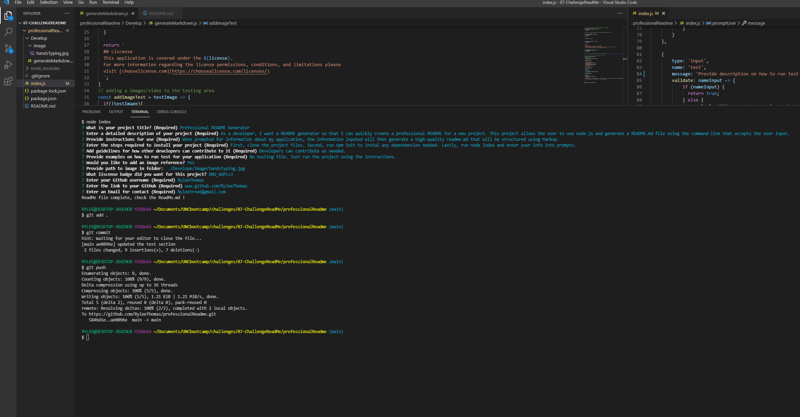

  # Professional README Generator
  

  ## Description 
  As a developer, I want a README generator so that I can quickly create a professional README for a new project. This project allows the user to use node.js and generate a README.md file using the command-line that accepts the user input.

  ## Table of Contents 
  * [Installation](#installation)
  * [Usage](#Usage)
  
   * [License](#License)
  
  * [Contributing](#Contributing)
  * [Test](#Test)
  * [Questions](#Questions)
  
  ## Installation 
  First, clone the project files. Second, run npm init to instal any dependencies needed. Lastly, run node index and enter your info into prompts.

  ## Usage
  When prompted for information about my application, the information inputed will then generate a high-quality readme.md that will be structured using Markup.

  
  ## Liscense
  This application is covered under the GNU_AGPLv3.
  For more information regarding the license permissions, conditions, and limitations please
  visit [chooselicense.com](https://choosealicense.com/licenses/)
  

  ## Contributing
  Developers can contribute as needed.

  ## Test
  No testing file. Just run the project using the instructions. 
  

  ## Questions
  My Github username is RyleeThomas , if you would like to visit my GitHub page the link is: www.github.com/RyleeThomas
  For further quesitons please reach out via email: Ryleetreat@gmail.com

